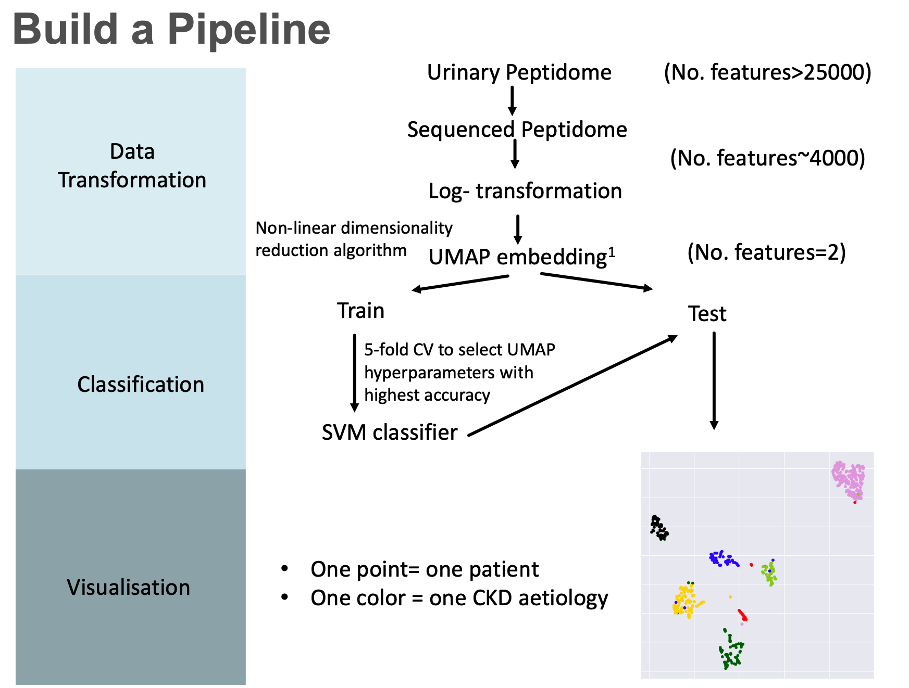
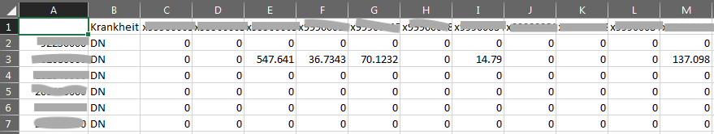
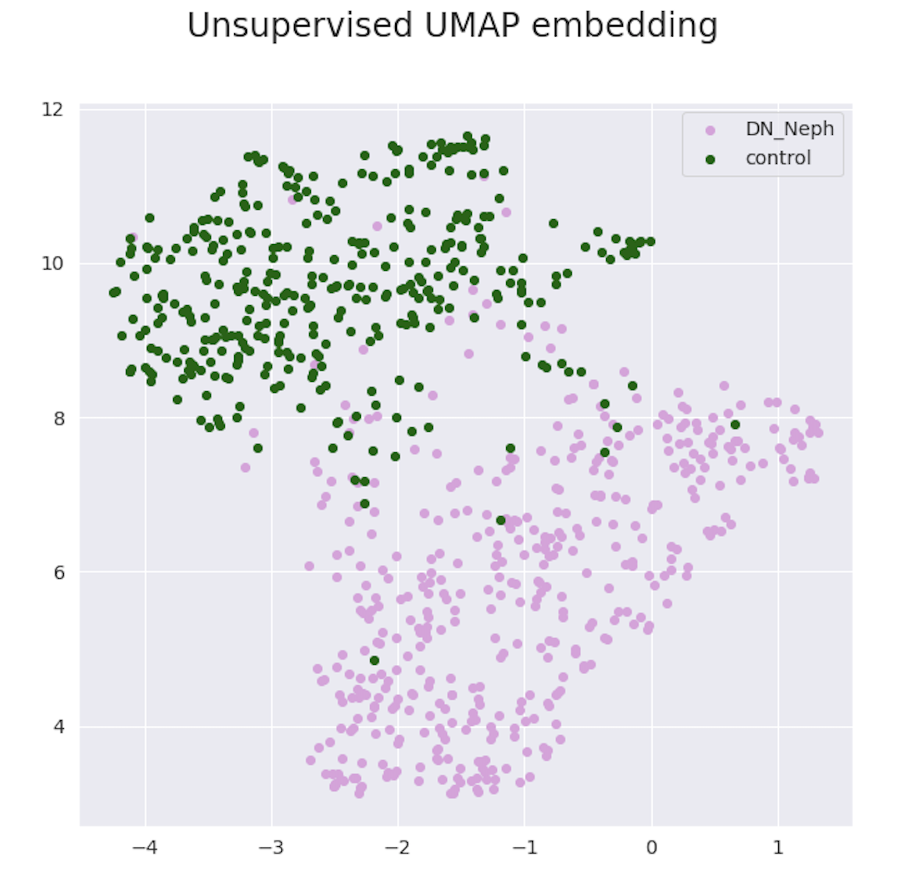
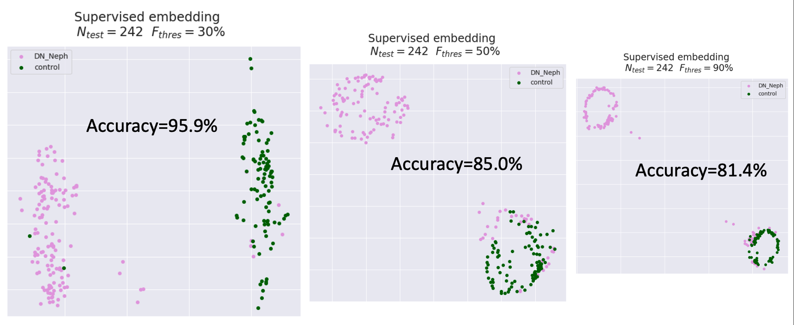
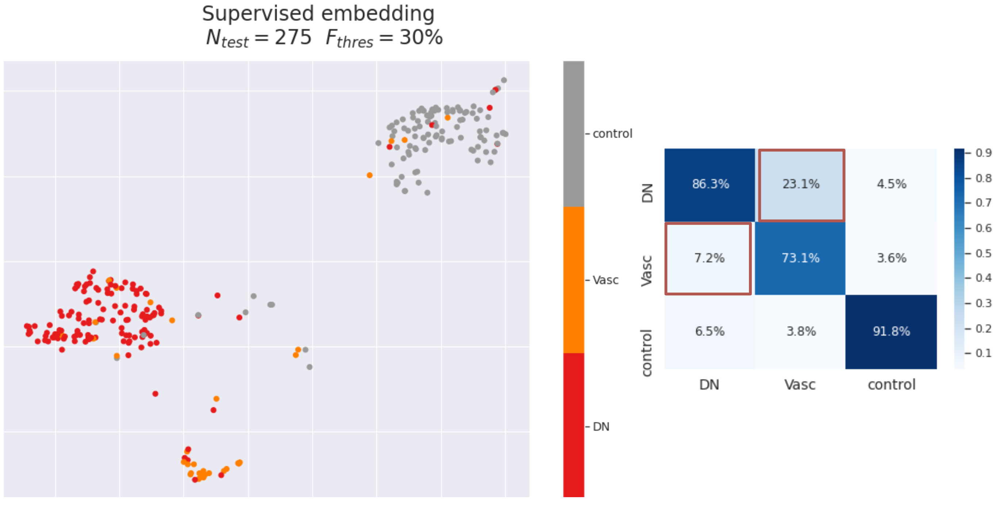

# Visualisation of peptidomic data using supervised UMAP

**UMAP** is a **dimensionality reduction** technique for non-linear embedding of high-dimensional data. In this project, UMAP is used to reduce the high-dimensional ($>4000$ features) peptidomic data. A **supervised learning** algorithm, **SVM**, is used to optimise the UMAP procedure such that patients with different kidney diseases can be **clustered** at **two-dimensional**. The detail description of UMAP can be found at: [Imcinnes/umap](https://github.com/lmcinnes/umap)

## Project Overview

Chronic kidney disease (CKD) has many causes, such as diabetic nephropathy (DN), vasculitis, IgA nephropathy. The aim of this project is to **visualise these CKD aetiologies in two dimension** based on **peptidomic profiles** that **maximise the separation between different aetiologies**. For this purpose, I developed a pipline built on UMAP and SVM:



## Data

The peptidomic data of patients with different CKD aetiologies were queried from the relational database. They were further pulled together, only the sequenced peptides were extracted. 

The sequenced peptidomic data were stored under `/data/curated/`:

* `dn_control_test_train.csv` sequenced peptides from DN and controls

* `dn_va_control_test_train.csv` sequenced peptides from DN, vasculitis and controls

Below is a screen shot of the first few line of the peptidomic data, where "Krankheit" means diagnosis:



## Codes

### Building the Pipeline

The pipeline includes two part, the supervised UMAP and plotting.

#### `umap_pipeline.py`

The pipeline of supervised UMAP, it includes several functionalities:

* `.pline(freq_thres=)` initialise a pipeline class instance, allows the user to set a certain frequency threshold of peptide filtering

* `pline.load_data(X,y)` load X (features) and y (diagnosis) into the pipeline

* `pline.logX()` log-transform of X

* `pline.train_test_split(train_size=)` split the data into train and test for supervised learning

* `pline.pipeline_fit()` fit the UMAP, implementing a grid search under the hood:

	* grid search of a user-defined combination UMAP parameters, `n_neighbors` and  `min_dist`. The default search range are 

		```
		"umap__n_neighbors": list(range(5,50,10)),
		"umap__min_dist":[0, 0.001,0.01,0.1,0.5],
		```

	* user-defined cross validation, with default `cv=5`

* `pline.get_accuracy()` return accuracy of the classification

* `pline.get_confusion_matrix(on=)` return confusion matrix on train or test dataset

* `pline.get_plot(on=, legend=, figout=)` plot the supervised 2-d embeddings of train or test dataset, with legend

#### `helper.py`

Provides helper functions to plot scatter plots with either legend as bar or as box inside the plot

#### `set_path.py`

Create useful abbreviations of path names

### Executing the Pipeline

#### `umap_unsupervised.ipynb`

Naïve UMAP embeddings of peptidomic data from DN and controls

#### `umap_supervised_dn_biomarker.ipynb` 

**Supervised UMAP** embeddings peptidomic data from DN and controls, with **preselction of biomarkers**

#### `umap_supervised_freq.ipynb` 

**Supervised UMAP** embeddings of peptidomic data from DN and controls, **varying frequency thresholds**

#### `umap_supervised_3disease.ipynb` 

**Supervised UMAP** embeddings of peptidomic data from **DN, vasculitis and controls**, with freq_threshold=30%

## Results

### 1. Unsupervised UMAP

With UMAP alone, DN and controls form two clusters with overlap. Therefore, I worked the supervised approach to improve separation.



### 2. Supervised UMAP between DN and controls

#### Approach 1: Preselection of biomarkers

I tried to preselect know biomarkers to DN, to see if accuracy can be improved. (The answer is yes!)


#### Approach 2: Varying the frequency threshold of peptides

I tried three frequency thresholds, 30%​, 50% and 70%. It shows that with 30%, the accuracy is the highest, with balanced specificity and sensitivity. Therefore, 30% will be set as a default of the pipeline.



### 3. Differential diagnosis of patients from **three** CKD aetiologies

I applied the pipeline in the peptidomic data of DN, vasculitis and controls. It shows that:

* The independent test data can be separated into three clusters, albeit misclassifications. 
* The misclassification is more pronouced between DN and vasculitis, showing that they are closer at peptide level (as expected)



## Conclusion and Future Plan

* The supervised UMAP approach has a potential in differential diagnosis of kidney diseases
* With the pipeline one can visualise different CKD aetiologies on a peptide-level
* The future plan is to collect more samples, so that the disease groups are balanced in size